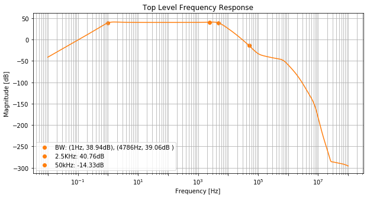

### Analog Cicuits for Sensor Systems - Spring 2020

#### Reference: Art of Electronics by P. Horowitz

#### Topics:
1. Foundations, sensor systems
2. Transistors: BJTs and MOSFETs
3. Operational Amplifiers
4. Precision Circuits
5. Noise
6. Filters
7. Sampling and Quantization
8. Data Converters

#### Strain-Gage Low-Noise Signal Conditioning

[ UWEE538/design_project/EEP538_Final.pdf ](https://github.com/kegedy/UWEE538/blob/master/design_project/EEP538_Final.pdf)

